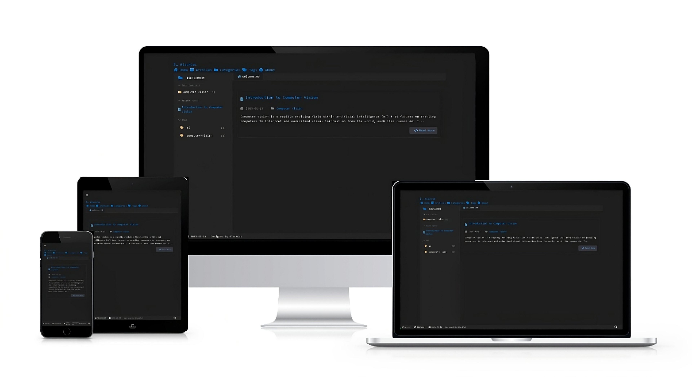

# 🐱 VSCat Theme for Hexo

> An elegant and minimalist theme for Hexo, designed with a dark color scheme and code-inspired aesthetics.

## ⭐ Support the Project

If you find this theme useful, please consider giving it a star on GitHub! Your support helps make the project more visible and encourages continued development.

<div align="center">
  <a href="https://github.com/B143KC47/VSC4T">
    
  </a>
  
  <p>Every star matters and is greatly appreciated! 🙏</p>
</div>

<div align="center">

[](source/doc/README.zh-CN.md)
[](LICENSE)
[](https://hexo.io)
[](https://nodejs.org)
[](https://www.codefactor.io/)

</div>

<div align="center">
  
  <p><em>Image credit: <a href="https://pixabay.com/photos/cat-black-cat-work-computer-963931/">Black cat at work by Pixabay</a></em></p>
</div>

<div align="center">
  
</div>

<div align="center">
  
</div>

## 📋 Table of Contents

- [✨ Features](#-features)
- [📊 Star History](#-star-history)
- [🚀 Installation](#-installation)
- [🔧 Configuration](#required-configuration)
- [🎨 Theme Color Switching](#-theme-color-switching)
- [🌍 Language Support](#-language-support)
- [📝 Blog Post Settings](#-blog-post-settings)
- [🎨 Custom Styling](#custom-styling)
- [📱 Mobile Optimization](#-mobile-optimization)
- [🔍 Search Configuration](#search-configuration)
- [💬 Comment System Configuration](#-comment-system-configuration)
- [📄 License](#-license)
- [💬 Support](#-support)

## ✨ Features

- 🌙 **Dark mode optimized** - Designed for comfortable reading
- ☀️ **Light/Dark theme switching** - Choose between VS Code Dark+ and Light+ themes
- 📱 **Fully responsive** - Perfect display on all devices
- 🚀 **Fast loading** - Optimized performance
- 🎨 **Clean design** - Minimalist and elegant interface
- 🔍 **VS Code style search** - Familiar and powerful search functionality
- 📊 **Code highlighting** - Beautiful syntax highlighting in VS Code style
- 🔧 **Easy configuration** - Simple and intuitive setup
- 📂 **Explorer-like sidebar** - Intuitive navigation for categories and tags
- 🌐 **Multi-language support** - 12 languages available out of the box
- 🧜🏻‍♀️ **Mermaid diagrams support** - Integrated support for Mermaid diagrams
- 📌 **Sticky posts** - Pin important posts to the top of your blog
- 🎨 **Custom favicon support** - Multi-format favicon configuration
- 💬 **Multiple comment systems** - Support for Waline and Disqus with theme auto-switching

## 📊 Star History

<a href="https://star-history.com/#B143KC47/VSC4T">
  <picture>
    <source media="(prefers-color-scheme: dark)" srcset="https://api.star-history.com/svg?repos=B143KC47/VSC4T&type=Date&theme=dark" />
    <source media="(prefers-color-scheme: light)" srcset="https://api.star-history.com/svg?repos=B143KC47/VSC4T&type=Date" />
    
  </picture>
</a>

## 🚀 Installation

1. Navigate to your Hexo site's themes directory:
   ```bash
   cd themes
   ```

2. Clone this repository:
   ```bash
   git clone https://github.com/B143KC47/VSC4T.git
   ```

3. Set the theme in your site's configuration:
   ```yaml
   theme: VSC4T
   ```

## Required Configuration

### Enable Relative Links

For proper theme deployment, set the following in your Hexo site's `_config.yml`:

```yaml
relative_link: true
```

Without enabling relative links, the theme may not deploy and function correctly.

For proper code block rendering, set the following in your Hexo site's `_config.yml`:

```yaml
hljs: true
```

Otherwise you might encounter issues that code block rendered with empty lines.

### Create Required Pages

This theme requires the following pages. Make sure to create them:

1. Create Categories page:
   ```bash
   hexo new page categories
   ```
   Then edit `source/categories/index.md` and add 
   ```
   ---
   title: categories
   layout: categories
   ---
   ```
2. Create Tags page:
   ```bash
   hexo new page tags
   ```
   Then edit `source/tags/index.md` and add `type: "tags"`
   ```
   ---
   title: tags
   layout: tags
   ---
   ```
3. Create About page:
   ```bash
   hexo new page about
   ```
   And add your personal information to `source/about/index.md`
   ```
   ---
   title: about
   date: 2025-02-22 22:14:44
   ---

   A very good simple theme

   ```
4. Create Search page:
   ```bash
   hexo new page search
   ```
   Then edit `source/search/index.md` and add:
   ```
   ---
   title: search
   layout: search
   ---
   ```

## 🔧 Theme Configuration

Modify the `_config.yml` in the theme directory:

```yaml
# Basic Information
name: BlackCat
description: A simple dark Hexo theme inspired by code.
author: YourName

# Style Configuration
style:
  # Color scheme ('dark' or 'white')
  colorscheme: 'dark'

# Basic Website Configuration
url: https://b143kc47.github.io/VSC4T 
root: /VSC4T/ 

# Menu Configuration
url: https://B143KC47.github.io/xxxxx # actual url
root: /xxxxxx/  # If your website is deployed in a subdirectory, you need to configure the root property


# _config.yml
syntax_highlighter: highlight.js
highlight:
  auto_detect: true
  line_number: true
  line_threshold: 0
  tab_replace: ""
  exclude_languages:
    - example
  wrap: true
  hljs: true
prismjs:
  preprocess: true
  line_number: true
  line_threshold: 0
  tab_replace: ""
```

## 🎨 Theme Color Switching

VSC4T now supports both dark and light themes inspired by VS Code's Dark+ and Light+ color schemes.

### Switching Between Themes

To switch between dark and light themes, modify the `colorscheme` setting in the theme's `_config.yml`:

```yaml
# Style configuration
style:
  # Color scheme ('dark' or 'white')
  colorscheme: 'dark'  # Use 'white' for light theme
```

### Available Color Schemes

- **`dark`** - VS Code Dark+ inspired theme (default)
  - Dark backgrounds with light text
  - Optimized for low-light environments
  - Reduces eye strain during night coding sessions

- **`white`** - VS Code Light+ inspired theme
  - Light backgrounds with dark text
  - Perfect for well-lit environments
  - Clean and professional appearance

### How to Apply Theme Changes

After changing the `colorscheme` setting:

1. Clean your Hexo cache:
   ```bash
   hexo clean
   ```

2. Regenerate your site:
   ```bash
   hexo generate
   ```

3. Start your server to see the changes:
   ```bash
   hexo server
   ```

### Troubleshooting Theme Switching

If the theme doesn't change after updating the configuration:

1. **Clear browser cache** - Use Ctrl+F5 or Cmd+Shift+R to hard refresh
2. **Try incognito mode** - Test in a private browser window
3. **Check configuration** - Ensure the `colorscheme` value is exactly 'dark' or 'white'
4. **Verify file generation** - Make sure `hexo clean` and `hexo generate` completed successfully

## 🌍 Language Support

<details>
<summary>Click to expand supported languages</summary>

- 🇺🇸 English (en)
- 🇨🇳 Simplified Chinese (zh-CN)
- 🇯🇵 Japanese (ja)
- 🇰🇷 Korean (ko)
- 🇫🇷 French (fr)
- 🇩🇪 German (de)
- 🇪🇸 Spanish (es)
- 🇮🇹 Italian (it)
- 🇷🇺 Russian (ru)
- 🇵🇹 Portuguese (pt)
- 🇦🇪 Arabic (ar)
- 🇻🇳 Vietnamese (vi)

</details>

### Language Configuration Example

To use a different language, set the `language` parameter in your site's `_config.yml`:

```yaml
# For Japanese
language: ja

# For Korean
language: ko

# For French
language: fr
```


## 📝 Blog Post Settings

### Creating a New Post

```bash
hexo new post "Your Post Title"
```

<details>
<summary>Click to see example post format</summary>

```markdown
---
title: VSC4T - A Dark and Elegant Hexo Theme
date: 2023-06-15 10:30:00
tags: [hexo, theme, dark-mode, responsive]
categories: [web-design, themes]
---

Your post content goes here...
```
</details>

2. This will create a new markdown file in `source/_posts/your-post-title.md`

### Creating a Sticky/Pinned Post

To make a post stick to the top of your homepage and archive:

```markdown
---
title: Important Announcement
date: 2024-01-01 10:00:00
sticky: true
tags: [announcement]
categories: [news]
---

Your important content here...
```

Sticky posts will:
- Always appear at the top of post lists
- Display a pin icon (📌) indicator
- Maintain chronological order among other sticky posts

## Favicon Configuration

The theme supports custom favicon configuration with multiple formats and sizes for different devices:

1. Place your favicon files in the theme's `source/` directory
2. Configure the paths in the theme's `_config.yml`:

```yaml
# Favicon configuration
favicon:
  ico: /favicon.ico                    # Traditional favicon format
  small: /favicon-16x16.png           # 16x16 PNG
  medium: /favicon-32x32.png          # 32x32 PNG
  large: /favicon-192x192.png         # 192x192 PNG (Android)
  apple_touch_icon: /apple-touch-icon.png  # 180x180 (iOS)
```

Recommended favicon sizes:
- `favicon.ico`: Multi-resolution ICO file
- `favicon-16x16.png`: For browser tabs
- `favicon-32x32.png`: For browser shortcuts
- `favicon-192x192.png`: For Android devices
- `apple-touch-icon.png`: 180x180 for iOS devices

## Custom Styling

This theme supports custom CSS and JS. In the theme configuration:

```yaml
custom_css:
  - /css/mobile.css
custom_js:
  - /js/code-copy.js
  - /js/mobile-menu.js
```

## 📱 Mobile Optimization

The theme is fully optimized for mobile devices with:

- Responsive design
- Touch-friendly navigation
- Optimized reading experience

## Code Highlighting

This theme uses built-in code highlighting by default. You can adjust it through the following settings:

```yaml
highlight:
  enable: true
  line_number: true
  auto_detect: true
```

## Mermaid Diagrams Support
The theme support mermaid diagrams, you need to install the following plugin to make sure it can render properly:

```bash
npm install hexo-filter-mermaid-diagrams
```

## Search Configuration

The theme includes a powerful search functionality inspired by VS Code's search interface. The search feature allows users to:

- Search through all blog posts and pages
- Filter by title, content, tags, and categories
- Use keyboard navigation (↑↓ arrows and Enter)
- See highlighted search matches
- Get context-aware search previews

### Enabling Search

Search is enabled by default. The search index is automatically generated when you build your site. You can customize the search behavior in your site's `_config.yml`:

```yaml
search:
  path: search.json        # Path to generate the search index file
  field: post             # Search field, available: post, page, all
  content: true           # Whether to include post/page content
  format: html            # Content format to parse, available: html, raw
```

### Search Keyboard Shortcuts

- `↑` / `↓`: Navigate through search results
- `Enter`: Open selected result
- `Esc`: Clear search input

### Search Filters

The search interface includes filters for:
- Titles
- Content
- Tags
- Categories

Users can toggle these filters to narrow down their search results.

## 💬 Comment System Configuration

The theme now supports multiple comment systems with automatic theme switching between dark and light modes.

### Supported Comment Systems

- **Waline** (Recommended) - Privacy-friendly, no login required
- **Disqus** - Traditional comment system

### Configuring Waline (Recommended)

Waline is a privacy-friendly comment system that allows anonymous comments without requiring login. It's perfect for readers who want to comment without creating an account.

1. Deploy Waline server (Free options):
   - **Vercel** (Recommended): [Deploy to Vercel](https://vercel.com/new/clone?repository-url=https://github.com/walinejs/waline/tree/main/example)
   - **Railway**: [Deploy to Railway](https://railway.app/template/1LZnmQ)
   - Other options: [Waline Quick Start](https://waline.js.org/en/guide/get-started/)

2. Update the theme's `_config.yml`:

```yaml
# Comment System Configuration
comments:
  provider: waline  # Options: 'waline' | 'disqus' | false
  
  # Waline Configuration
  waline:
    serverURL: https://your-domain.vercel.app  # Your Waline server URL
    lang: en  # or zh-CN for Chinese
    locale: {}  # Custom locale
    emoji:
      - https://unpkg.com/@waline/emojis@1.2.0/weibo
    requiredMeta: []  # No required fields for anonymous comments
    login: disable  # Disable login to allow anonymous comments
    wordLimit: 0  # Comment word limit, 0 for no limit
    pageSize: 10  # Comments per page
    imageUploader: false  # Disable image upload
```

### Configuring Disqus

```yaml
comments:
  provider: disqus
  
  disqus:
    shortname: your-disqus-shortname
```

### Features

- 🎨 **Automatic theme switching** - Comments adapt to VS Code dark/light theme
- 📱 **Responsive design** - Works perfectly on all devices
- 🌍 **Multi-language support** - Follows your site's language setting
- 🚀 **Lazy loading** - Comments load only when needed
- 🔒 **Privacy-friendly** - Waline allows anonymous comments without tracking

### Disabling Comments

To disable comments on specific posts:

```yaml
---
title: My Post
comments: false
---
```

To disable comments globally, set `provider: false` in the configuration.

## 👨‍💻 Contributors

Thanks to all the contributors who have helped make this theme better!

<div align="center">
  <a href="https://github.com/B143KC47/VSC4T/graphs/contributors">
    
  </a>
  <p>Note: If contributors aren't showing correctly, they may need to have their contributions properly linked to their GitHub accounts. Check that commits are associated with GitHub emails.</p>
</div>

### How to Contribute

We welcome all contributions to improve VSC4T theme! Here's how you can help:

1. Fork the repository
2. Create your feature branch: `git checkout -b feature/amazing-feature`
3. Commit your changes: `git commit -m 'Add some amazing feature'`
4. Push to the branch: `git push origin feature/amazing-feature`
5. Open a Pull Request

For more details, please read our [Contributing Guidelines](CONTRIBUTING.md).

## 📄 License

This theme is released under the [MIT License](LICENSE).

## 💬 Support

If you have any questions or need help, please [open an issue](https://github.com/B143KC47/VSC4T/issues) in the GitHub repository.
